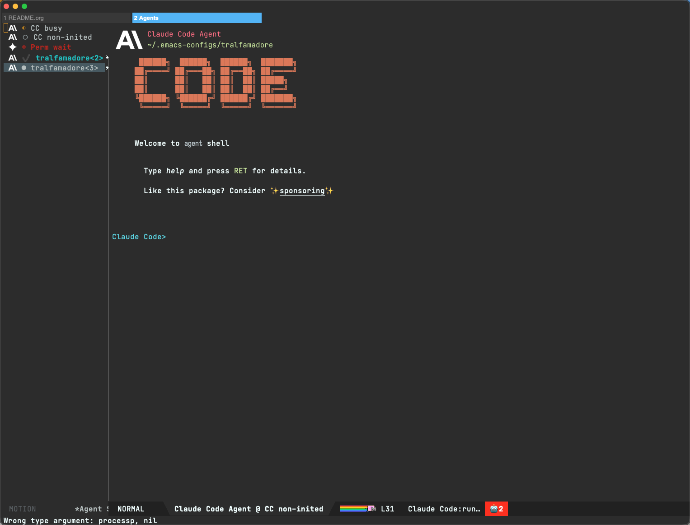
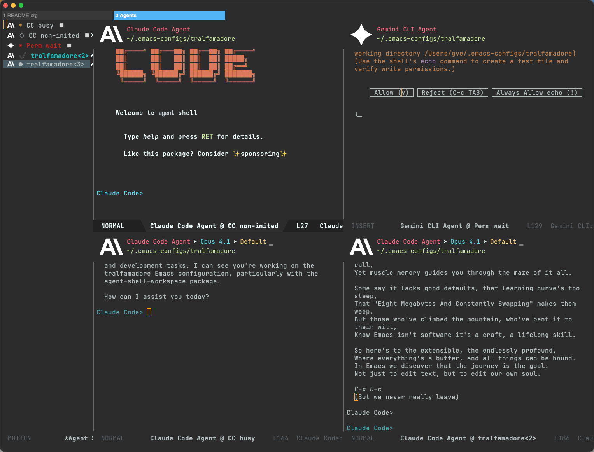

# agent-shell-workspace

A dedicated tab-bar workspace for [agent-shell](https://github.com/xenodium/agent-shell) buffers in Emacs.

Toggle into an "Agents" tab with a compact sidebar, buffer isolation, and tiling — then toggle back to your regular work. Non-agent buffers never pollute the workspace.





## Features

- **Dedicated tab-bar tab** — one keypress to switch between coding and agent monitoring
- **Compact sidebar** — shows each agent's icon, status, and name at a glance
- **Status icons** — `●` ready, `◐` working, `◉` waiting for input (red), `✔` finished (cyan), `○` initializing, `✕` killed
- **Buffer isolation** — opening a file or switching to a non-agent buffer auto-redirects to your editing tab
- **Tiling** — view 2–8 agents side-by-side in an auto-arranged grid
- **Quick switch** — peek at agents by moving up/down in the sidebar without losing focus
- **Agent management** — kill, restart, rename, set mode, interrupt — all from the sidebar

## Requirements

- Emacs 29.1+
- [agent-shell](https://github.com/xenodium/agent-shell) 0.24.2+

## Installation

### use-package (Emacs 29+)

```elisp
(use-package agent-shell-workspace
  :vc (:url "https://github.com/gveres/agent-shell-workspace")
  :ensure t
  :after agent-shell
  :bind (:map agent-shell-command-map ("w" . agent-shell-workspace-toggle)))
```

### Manual

Download `agent-shell-workspace.el`, place it in your `load-path`, then:

```elisp
(require 'agent-shell-workspace)
(define-key agent-shell-command-map (kbd "w") 'agent-shell-workspace-toggle)
```

## Usage

Press `C-c A w` (or your configured binding) to toggle the workspace. The Agents tab opens with a sidebar on the left and your most recent agent in the main area.

### Sidebar keybindings

| Key | Action |
|-----|--------|
| `RET` | Focus agent in main area |
| `s` | Toggle quick-switch (peek on cursor move) |
| `a` | Add agent to tiled view |
| `x` | Remove agent from tiled view |
| `t` | Un-tile back to single focus |
| `R` | Rename agent buffer |
| `c` | Create new agent |
| `k` | Kill agent process |
| `r` | Restart agent |
| `d` | Delete all killed buffers |
| `m` | Set session mode |
| `M` | Cycle session mode |
| `C-c C-c` | Interrupt agent |
| `g` | Refresh sidebar |
| `q` | Close sidebar |

### Tiling

Press `a` on each agent you want to tile. The first press marks the agent (shown with `▫`), the second triggers the split. Add up to 8 agents. Press `x` to remove one, `t` to un-tile entirely.

### Buffer isolation

While in the Agents tab, any attempt to display a non-agent buffer (via `find-file`, `xref`, `switch-to-buffer`, etc.) automatically switches you to your previous tab first. Agent-related buffers (diffs, traffic logs) are allowed through.

## Acknowledgements

Status detection logic adapted from [agent-shell-manager.el](https://github.com/jethrokuan) by Jethro Kuan.

## License

GPL-3.0-or-later
